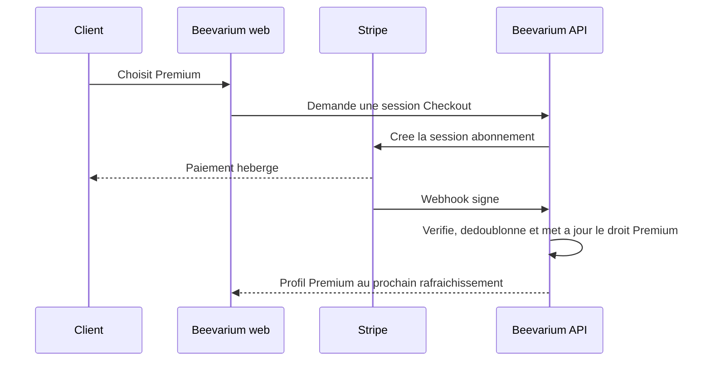

# Paiements et abonnements

## Statut

Ce document prepare l'architecture. Aucun paiement ne doit etre active pendant
la beta privee. Les nouveaux comptes beta restent Premium via le reglage dedie
de l'environnement beta.

## Parcours recommande sur le web

Le premier fournisseur a integrer est **Stripe Billing avec Stripe Checkout**.
Il couvre une grande partie des moyens de paiement sans que Beevarium ne voie
jamais de numero de carte :

| Moyen de paiement | Parcours web recommande |
|---|---|
| Carte bancaire | Stripe Checkout |
| Apple Pay | Stripe Checkout, sur appareil et navigateur compatibles |
| Google Pay | Stripe Checkout, sur appareil et navigateur compatibles |
| Link | Option Stripe utile mais non indispensable |
| PayPal | Activer comme methode Stripe si l'eligibilite France et l'abonnement recurrent sont confirmes ; sinon l'ajouter dans un second temps via PayPal Checkout |

Commencer avec carte, Apple Pay et Google Pay. Ajouter PayPal seulement apres
verification dans le tableau de bord Stripe et un test de paiement/retrait en
mode test. Un seul fournisseur reduit les remboursements, rapprochements et
webhooks a maintenir.

Le parcours client cible est :

Le portail client Stripe permet ensuite au client de changer de carte, recuperer
ses factures et resilier. Il est preferable a un ecran de gestion bancaire
developpe sur mesure.

## Regle essentielle d'autorisation

Le client ne doit jamais pouvoir envoyer `is_premium=true` pour acheter
Premium. La source de verite doit etre un droit d'abonnement calcule par le
serveur apres un webhook verifie.

Le champ `users.is_premium` actuel peut rester temporairement la projection de
ce droit, mais l'implementation paiement devra ajouter au minimum :

| Donnee | Usage |
|---|---|
| `billing_customers` | Identifiant client du fournisseur, lie a un utilisateur |
| `subscriptions` | Fournisseur, identifiant abonnement, statut, produit, periode de fin |
| `payment_events` | Identifiant evenement fournisseur unique, charge utile minimale et date de traitement |

Les webhooks doivent : verifier la signature avec le secret configure hors Git,
dedoublonner sur l'identifiant d'evenement, etre idempotents, et journaliser
seulement les identifiants necessaires. Ne jamais stocker de carte, CVV, secret
de webhook ou charge utile contenant des donnees inutiles.

## Web et stores : deux circuits

| Canal | Paiement Premium |
|---|---|
| Site web Beevarium | Stripe Checkout, puis PayPal si valide |
| Application iPhone distribuee par App Store | Achats integres Apple pour l'abonnement numerique |
| Application Android distribuee par Google Play | Google Play Billing pour l'abonnement numerique |

Apple Pay et Google Pay sont des moyens de paiement pour le **web**. Ils ne
remplacent pas les achats integres lorsqu'une application native vend un
abonnement numerique dans les stores. Plus tard, le serveur devra verifier les
notifications Apple et Google et les traduire vers le meme droit Premium.

## Destination de l'argent

Les versements Stripe, PayPal, Apple et Google doivent etre rattaches a
l'activite juridique qui vend Beevarium :

- societe : compte bancaire au nom de la societe ;
- micro-entreprise : compte dedie a l'activite fortement recommande des le
  debut, meme lorsque la loi ne l'impose pas encore ;
- ne pas utiliser durablement un compte personnel courant melangeant depenses
  privees et encaissements Beevarium.

Le compte du fournisseur de paiement doit etre verifie au nom du titulaire de
l'activite. Conserver factures, remboursements et releves de versement pour la
comptabilite. Valider le statut, la TVA, les prix TTC, la facturation et la
politique de remboursement avec un professionnel competent avant ouverture
commerciale.

## Decisions a prendre avant implementation

1. Choisir le statut juridique et le compte bancaire dedie.
2. Fixer l'offre : prix mensuel, prix annuel, essai gratuit et contenu Premium.
3. Definir annulation, remboursement, impayes et reprise apres echec de
   paiement.
4. Completer les mentions legales, CGU, confidentialite et politique de
   remboursement avec l'identite de l'editeur.
5. Creer les comptes Stripe et, si retenu, PayPal en mode test avec les
   coordonnees de l'activite.
6. Enregistrer les domaines web pour Apple Pay et Google Pay chez Stripe.
7. Ecrire puis tester les webhooks avant toute page de paiement publique.

## Plan d'implementation apres beta

1. Mode test Stripe : tables, produits, Checkout, portail client et webhook.
2. Tests de creation, renouvellement, annulation, remboursement et evenement
   duplique.
3. Mode production, avec un abonnement interne de test et un remboursement
   reellement verifie.
4. PayPal seulement si sa valeur pour les testeurs justifie la seconde
   integration.
5. Puis achats integres Apple et Google au moment du passage Capacitor/stores.

## Criteres d'acceptation

- aucun secret ni numero de carte n'apparait dans Beevarium, Git ou les logs ;
- seul un webhook fournisseur signe peut activer ou retirer Premium ;
- les evenements rejoues ne modifient pas deux fois un abonnement ;
- l'annulation conserve Premium jusqu'a la fin de periode payee ;
- le client peut resilier sans intervention manuelle ;
- un paiement test et un remboursement test sont rapproches dans le tableau de
  bord fournisseur et la comptabilite.